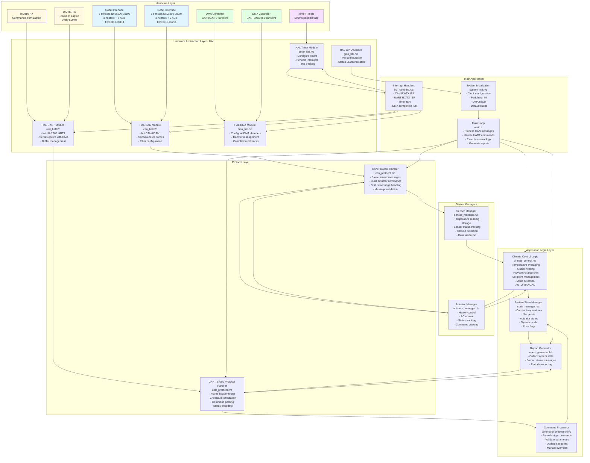

# Climate Control System Architecture
## K1921VK028 Microcontroller (ARM Cortex-M4F)

This document describes the software architecture for a room climate control system implemented on the K1921VK028 microcontroller using bare-metal C-11.

---

## System Overview

The climate control system manages:
- **11 temperature sensors** (6 on CAN0, 5 on CAN1)
- **6 heaters** (3 on CAN0, 3 on CAN1)
- **4 air conditioners** (2 on CAN0, 2 on CAN1)
- **Communication with laptop** via UART for monitoring and control

---

## Architecture Diagram



---

## Module Descriptions

### 1. Hardware Layer
Physical peripherals of the K1921VK028 microcontroller.

#### 1.1 CAN0 Interface
- **Purpose:** Communication with 6 temperature sensors and 5 actuators (3 heaters, 2 ACs)
- **RX Message IDs:** 
  - 0x100-0x103: Room temperature sensors 1-4
  - 0x104-0x105: Outdoor temperature sensors 1-2
- **TX Message IDs:**
  - 0x110-0x112: Heater commands 1-3
  - 0x113-0x114: AC commands 1-2

#### 1.2 CAN1 Interface
- **Purpose:** Communication with 5 temperature sensors and 5 actuators (3 heaters, 2 ACs)
- **RX Message IDs:** 
  - 0x200-0x204: Room temperature sensors 5-9
- **TX Message IDs:**
  - 0x210-0x212: Heater commands 4-6
  - 0x213-0x214: AC commands 3-4

#### 1.3 UART0 RX
- **Purpose:** Receive control commands from laptop
- **Protocol:** Binary protocol with header, payload, checksum
- **DMA:** Enabled for efficient reception

#### 1.4 UART1 TX
- **Purpose:** Send status reports to laptop every 500ms
- **Protocol:** Binary protocol with header, payload, checksum
- **DMA:** Enabled for efficient transmission

#### 1.5 Timers
- **Purpose:** Generate periodic 500ms interrupts for status reporting
- **Usage:** Time base for control loop and communication scheduling

#### 1.6 DMA Controllers
- **Purpose:** Offload CPU during CAN and UART data transfers
- **Configuration:** Dedicated channels for UART RX/TX and CAN RX/TX

---

### 2. Hardware Abstraction Layer (HAL)

#### 2.1 HAL CAN Module [`can_hal.h`](can_hal.h) / [`can_hal.c`](can_hal.c)
**Purpose:** Provide hardware-independent CAN communication interface

**API Functions:**
```c
void CAN_HAL_Init(CAN_Channel_t channel, uint32_t baudrate);
int CAN_HAL_Send(CAN_Channel_t channel, uint32_t id, uint8_t* data, uint8_t len);
int CAN_HAL_Receive(CAN_Channel_t channel, uint32_t* id, uint8_t* data, uint8_t* len);
void CAN_HAL_SetFilter(CAN_Channel_t channel, uint32_t* filter_ids, uint8_t count);
bool CAN_HAL_IsTxReady(CAN_Channel_t channel);
```

**Data Flow:**
- **Input:** CAN0/CAN1 hardware registers
- **Output:** Parsed CAN frames to CAN Protocol Handler

#### 2.2 HAL UART Module [`uart_hal.h`](uart_hal.h) / [`uart_hal.c`](uart_hal.c)
**Purpose:** Provide hardware-independent UART communication with DMA

**API Functions:**
```c
void UART_HAL_Init(UART_Channel_t channel, uint32_t baudrate);
int UART_HAL_SendDMA(UART_Channel_t channel, uint8_t* data, uint16_t len);
int UART_HAL_ReceiveDMA(UART_Channel_t channel, uint8_t* buffer, uint16_t len);
bool UART_HAL_IsTxComplete(UART_Channel_t channel);
uint16_t UART_HAL_GetRxCount(UART_Channel_t channel);
```

**Data Flow:**
- **Input:** UART0 RX buffer (from laptop)
- **Output:** UART1 TX buffer (to laptop)

#### 2.3 HAL Timer Module [`timer_hal.h`](timer_hal.h) / [`timer_hal.c`](timer_hal.c)
**Purpose:** Configure and manage timer peripherals

**API Functions:**
```c
void TIMER_HAL_Init(uint32_t period_ms);
void TIMER_HAL_Start(void);
void TIMER_HAL_Stop(void);
void TIMER_HAL_RegisterCallback(void (*callback)(void));
```

**Data Flow:**
- **Output:** Periodic interrupts to trigger status reporting

#### 2.4 HAL DMA Module [`dma_hal.h`](dma_hal.h) / [`dma_hal.c`](dma_hal.c)
**Purpose:** Configure DMA channels for peripheral data transfers

**API Functions:**
```c
void DMA_HAL_Init(void);
void DMA_HAL_ConfigChannel(DMA_Channel_t ch, DMA_Config_t* config);
void DMA_HAL_StartTransfer(DMA_Channel_t ch);
void DMA_HAL_RegisterCallback(DMA_Channel_t ch, void (*callback)(void));
```

#### 2.5 HAL GPIO Module [`gpio_hal.h`](gpio_hal.h) / [`gpio_hal.c`](gpio_hal.c)
**Purpose:** Configure GPIO pins for status LEDs and indicators

**API Functions:**
```c
void GPIO_HAL_Init(void);
void GPIO_HAL_SetPin(GPIO_Pin_t pin, bool state);
void GPIO_HAL_TogglePin(GPIO_Pin_t pin);
```

---

### 3. Protocol Layer

#### 3.1 CAN Protocol Handler [`can_protocol.h`](can_protocol.h) / [`can_protocol.c`](can_protocol.c)
**Purpose:** Encode/decode CAN messages for sensors and actuators

**Responsibilities:**
- Parse incoming temperature sensor messages
- Validate message format and data
- Build actuator command messages (ON/OFF, power level)
- Handle status messages (OK/Error/Running/Waiting)

**API Functions:**
```c
void CAN_PROTO_Init(void);
bool CAN_PROTO_ParseSensorMsg(uint32_t id, uint8_t* data, uint8_t len, SensorData_t* out);
void CAN_PROTO_BuildActuatorCmd(uint32_t id, ActuatorCmd_t* cmd, uint8_t* data, uint8_t* len);
bool CAN_PROTO_ParseStatusMsg(uint32_t id, uint8_t* data, uint8_t len, DeviceStatus_t* out);
```

**Data Structures:**
```c
typedef struct {
    float temperature;      // Temperature in Celsius
    uint8_t sensor_id;      // Sensor identifier
    uint32_t timestamp;     // Message timestamp
    bool valid;             // Data validity flag
} SensorData_t;

typedef struct {
    bool enable;            // ON/OFF command
    uint8_t power_level;    // Power level 0-100%
    uint8_t mode;           // Heating/Cooling mode
} ActuatorCmd_t;

typedef enum {
    STATUS_OK = 0,
    STATUS_ERROR = 1,
    STATUS_RUNNING = 2,
    STATUS_WAITING = 3
} DeviceStatus_t;
```

**Data Flow:**
- **Input:** Raw CAN frames from HAL CAN
- **Output:** Structured sensor data to Sensor Manager
- **Output:** Actuator commands to HAL CAN

#### 3.2 UART Binary Protocol Handler [`uart_protocol.h`](uart_protocol.h) / [`uart_protocol.c`](uart_protocol.c)
**Purpose:** Implement binary protocol for laptop communication

**Protocol Format:**
```
[Header: 2 bytes][Length: 2 bytes][Type: 1 byte][Payload: N bytes][Checksum: 2 bytes]
```

**Responsibilities:**
- Parse incoming command frames from laptop
- Validate frame structure and checksum (CRC16 or simple sum)
- Encode status report frames for transmission
- Buffer management for DMA transfers

**API Functions:**
```c
void UART_PROTO_Init(void);
bool UART_PROTO_ParseCommand(uint8_t* buffer, uint16_t len, Command_t* out);
uint16_t UART_PROTO_BuildStatusReport(SystemState_t* state, uint8_t* buffer);
uint16_t UART_PROTO_CalculateChecksum(uint8_t* data, uint16_t len);
bool UART_PROTO_ValidateChecksum(uint8_t* frame, uint16_t len);
```

**Command Types:**
```c
typedef enum {
    CMD_SET_TEMPERATURE = 0x01,     // Set target temperature
    CMD_SET_MODE = 0x02,            // Auto/Manual mode
    CMD_MANUAL_HEATER = 0x03,       // Manual heater control
    CMD_MANUAL_AC = 0x04,           // Manual AC control
    CMD_GET_STATUS = 0x05           // Request status
} CommandType_t;

typedef struct {
    CommandType_t type;
    uint8_t payload[64];
    uint8_t payload_len;
} Command_t;
```

**Data Flow:**
- **Input:** Raw UART frames from HAL UART
- **Output:** Parsed commands to Command Processor
- **Input:** System state from Report Generator
- **Output:** Formatted status frames to HAL UART

---

### 4. Device Managers

#### 4.1 Sensor Manager [`sensor_manager.h`](sensor_manager.h) / [`sensor_manager.c`](sensor_manager.c)
**Purpose:** Manage all temperature sensors across both CAN buses

**Responsibilities:**
- Store latest temperature readings from all 11 sensors
- Track sensor online/offline status
- Detect sensor timeouts (no data received)
- Validate temperature ranges
- Provide temperature data to Climate Control Logic

**API Functions:**
```c
void SENSOR_MGR_Init(void);
void SENSOR_MGR_Update(uint8_t sensor_id, float temperature);
bool SENSOR_MGR_GetTemperature(uint8_t sensor_id, float* temp);
bool SENSOR_MGR_IsOnline(uint8_t sensor_id);
void SENSOR_MGR_GetAllRoomTemperatures(float* temps, uint8_t* count);
void SENSOR_MGR_GetOutdoorTemperatures(float* temps, uint8_t* count);
void SENSOR_MGR_CheckTimeouts(void);
```

**Internal State:**
```c
typedef struct {
    float temperature;
    uint32_t last_update;
    bool online;
    bool valid;
    DeviceStatus_t status;
} Sensor_t;

// Array of all sensors
Sensor_t sensors[11];
```

**Data Flow:**
- **Input:** Sensor data from CAN Protocol Handler
- **Output:** Temperature readings to Climate Control Logic

#### 4.2 Actuator Manager [`actuator_manager.h`](actuator_manager.h) / [`actuator_manager.c`](actuator_manager.c)
**Purpose:** Manage all heaters and air conditioners

**Responsibilities:**
- Store current state of all 6 heaters and 4 ACs
- Queue commands for actuators
- Track actuator status (OK/Error/Running/Waiting)
- Prevent conflicting commands (heater and AC on simultaneously)
- Provide actuator status to Report Generator

**API Functions:**
```c
void ACTUATOR_MGR_Init(void);
void ACTUATOR_MGR_SetHeater(uint8_t heater_id, bool enable, uint8_t power);
void ACTUATOR_MGR_SetAC(uint8_t ac_id, bool enable, uint8_t power);
void ACTUATOR_MGR_GetStatus(uint8_t actuator_id, DeviceStatus_t* status);
void ACTUATOR_MGR_UpdateStatus(uint8_t actuator_id, DeviceStatus_t status);
void ACTUATOR_MGR_ProcessQueue(void);
```

**Internal State:**
```c
typedef struct {
    bool enable;
    uint8_t power_level;
    DeviceStatus_t status;
    uint32_t last_cmd_time;
} Actuator_t;

// Arrays for heaters and ACs
Actuator_t heaters[6];
Actuator_t air_conditioners[4];
```

**Data Flow:**
- **Input:** Control commands from Climate Control Logic
- **Output:** Actuator commands to CAN Protocol Handler
- **Input:** Status updates from CAN Protocol Handler

---

### 5. Application Logic Layer

#### 5.1 Climate Control Logic [`climate_control.h`](climate_control.h) / [`climate_control.c`](climate_control.c)
**Purpose:** Core control algorithm for maintaining desired temperature

**Responsibilities:**
- Calculate average room temperature from 9 room sensors
- Filter outliers using statistical methods (e.g., median, IQR filtering)
- Implement control algorithm (PID or simple bang-bang control)
- Decide which heaters/ACs to activate and at what power
- Support AUTO mode (temperature-based) and MANUAL mode (direct control)
- Consider outdoor temperature for optimization

**API Functions:**
```c
void CLIMATE_CTRL_Init(void);
void CLIMATE_CTRL_SetTargetTemp(float target_celsius);
float CLIMATE_CTRL_GetTargetTemp(void);
void CLIMATE_CTRL_SetMode(ControlMode_t mode);
float CLIMATE_CTRL_CalculateAverage(float* temps, uint8_t count);
void CLIMATE_CTRL_Execute(void);  // Main control loop
```

**Algorithm Details:**

**Temperature Averaging with Outlier Filtering:**
```c
float CLIMATE_CTRL_CalculateAverage(float* temps, uint8_t count) {
    // 1. Sort temperatures
    // 2. Remove outliers using IQR method or reject extremes
    // 3. Calculate average of remaining values
    // 4. Return filtered average
}
```

**Control Algorithm (Simplified PID):**
```c
void CLIMATE_CTRL_Execute(void) {
    // 1. Get all room temperatures
    // 2. Calculate filtered average
    // 3. Calculate error = target - current
    // 4. Apply PID control: output = Kp*error + Ki*integral + Kd*derivative
    // 5. Distribute output among heaters/ACs based on capacity
    // 6. Send commands via Actuator Manager
}
```

**Data Structures:**
```c
typedef enum {
    MODE_AUTO,       // Automatic temperature control
    MODE_MANUAL      // Manual control from laptop
} ControlMode_t;

typedef struct {
    float target_temperature;
    float current_temperature;
    float integral_error;
    float last_error;
    ControlMode_t mode;
    // PID parameters
    float Kp;
    float Ki;
    float Kd;
} ClimateControl_t;
```

**Data Flow:**
- **Input:** Temperature readings from Sensor Manager
- **Input:** Target temperature from State Manager
- **Output:** Actuator commands to Actuator Manager

#### 5.2 System State Manager [`state_manager.h`](state_manager.h) / [`state_manager.c`](state_manager.c)
**Purpose:** Centralized storage for all system state information

**Responsibilities:**
- Store current temperatures from all sensors
- Store target temperature and control parameters
- Store actuator states
- Store system mode and error flags
- Provide thread-safe access to state (if using interrupts)

**API Functions:**
```c
void STATE_MGR_Init(void);
void STATE_MGR_SetTargetTemp(float temp);
float STATE_MGR_GetTargetTemp(void);
void STATE_MGR_SetMode(ControlMode_t mode);
ControlMode_t STATE_MGR_GetMode(void);
void STATE_MGR_GetSystemState(SystemState_t* state);
void STATE_MGR_SetErrorFlag(ErrorCode_t error);
```

**System State Structure:**
```c
typedef struct {
    // Temperatures
    float sensor_temps[11];
    bool sensor_online[11];
    float average_room_temp;
    float target_temp;
    
    // Actuators
    bool heater_state[6];
    uint8_t heater_power[6];
    bool ac_state[4];
    uint8_t ac_power[4];
    DeviceStatus_t heater_status[6];
    DeviceStatus_t ac_status[4];
    
    // System
    ControlMode_t mode;
    uint32_t error_flags;
    uint32_t system_uptime;
} SystemState_t;
```

**Data Flow:**
- **Input:** State updates from all modules
- **Output:** State queries to all modules

#### 5.3 Command Processor [`command_processor.h`](command_processor.h) / [`command_processor.c`](command_processor.c)
**Purpose:** Process commands received from laptop via UART

**Responsibilities:**
- Validate command parameters
- Update system state based on commands
- Switch between AUTO and MANUAL modes
- Execute manual overrides for actuators
- Provide command acknowledgments

**API Functions:**
```c
void CMD_PROC_Init(void);
bool CMD_PROC_ProcessCommand(Command_t* cmd);
void CMD_PROC_SetTemperature(float temp);
void CMD_PROC_SetMode(ControlMode_t mode);
void CMD_PROC_ManualHeaterControl(uint8_t heater_id, bool enable, uint8_t power);
void CMD_PROC_ManualACControl(uint8_t ac_id, bool enable, uint8_t power);
```

**Command Processing Flow:**
```c
bool CMD_PROC_ProcessCommand(Command_t* cmd) {
    switch (cmd->type) {
        case CMD_SET_TEMPERATURE:
            // Validate range (e.g., 15-30°C)
            // Update State Manager
            // Return ACK
            break;
        case CMD_SET_MODE:
            // Switch AUTO/MANUAL
            break;
        case CMD_MANUAL_HEATER:
            // Direct heater control (MANUAL mode only)
            break;
        // ...
    }
}
```

**Data Flow:**
- **Input:** Commands from UART Protocol Handler
- **Output:** State updates to State Manager
- **Output:** Manual control commands to Actuator Manager

#### 5.4 Report Generator [`report_generator.h`](report_generator.h) / [`report_generator.c`](report_generator.c)
**Purpose:** Generate periodic status reports for laptop

**Responsibilities:**
- Collect system state every 500ms
- Format status information into binary protocol
- Include all sensor temperatures
- Include all actuator states and statuses
- Include error flags and system status

**API Functions:**
```c
void REPORT_GEN_Init(void);
void REPORT_GEN_Generate(uint8_t* buffer, uint16_t* len);
void REPORT_GEN_Periodic(void);  // Called from timer ISR
```

**Report Structure:**
```c
typedef struct {
    uint32_t timestamp;
    float sensor_temps[11];
    bool sensor_online[11];
    float average_temp;
    float target_temp;
    bool heater_state[6];
    uint8_t heater_power[6];
    DeviceStatus_t heater_status[6];
    bool ac_state[4];
    uint8_t ac_power[4];
    DeviceStatus_t ac_status[4];
    ControlMode_t mode;
    uint32_t error_flags;
} StatusReport_t;
```

**Data Flow:**
- **Input:** System state from State Manager
- **Input:** Sensor data from Sensor Manager
- **Input:** Actuator data from Actuator Manager
- **Output:** Formatted report to UART Protocol Handler

---

### 6. Main Application

#### 6.1 System Initialization [`system_init.h`](system_init.h) / [`system_init.c`](system_init.c)
**Purpose:** Initialize all system components at startup

**Responsibilities:**
- Configure system clock (PLL, prescalers)
- Initialize all peripheral modules
- Configure DMA channels
- Set default system state
- Enable interrupts

**Initialization Sequence:**
```c
void System_Init(void) {
    // 1. Clock configuration (e.g., 80MHz from PLL)
    RCU_Init();
    
    // 2. GPIO configuration for CAN, UART, LEDs
    GPIO_HAL_Init();
    
    // 3. DMA initialization
    DMA_HAL_Init();
    
    // 4. CAN initialization (CAN0, CAN1)
    CAN_HAL_Init(CAN_CHANNEL_0, 500000);  // 500kbps
    CAN_HAL_Init(CAN_CHANNEL_1, 500000);
    
    // 5. UART initialization (UART0, UART1)
    UART_HAL_Init(UART_CHANNEL_0, 115200);
    UART_HAL_Init(UART_CHANNEL_1, 115200);
    
    // 6. Timer initialization (500ms period)
    TIMER_HAL_Init(500);
    
    // 7. Protocol layer initialization
    CAN_PROTO_Init();
    UART_PROTO_Init();
    
    // 8. Manager initialization
    SENSOR_MGR_Init();
    ACTUATOR_MGR_Init();
    STATE_MGR_Init();
    
    // 9. Application logic initialization
    CLIMATE_CTRL_Init();
    CMD_PROC_Init();
    REPORT_GEN_Init();
    
    // 10. Set default temperature target
    STATE_MGR_SetTargetTemp(22.0f);  // 22°C default
    
    // 11. Enable interrupts
    NVIC_EnableIRQ(CAN0_IRQn);
    NVIC_EnableIRQ(CAN1_IRQn);
    NVIC_EnableIRQ(UART0_IRQn);
    NVIC_EnableIRQ(UART1_IRQn);
    NVIC_EnableIRQ(TIMER_IRQn);
    NVIC_EnableIRQ(DMA_IRQn);
}
```

#### 6.2 Main Loop [`main.c`](main.c)
**Purpose:** Main application execution loop

**Main Loop Structure:**
```c
int main(void) {
    // System initialization
    System_Init();
    
    // Start timer for periodic tasks
    TIMER_HAL_Start();
    
    // Main loop
    while (1) {
        // 1. Process incoming CAN messages (sensors & actuator status)
        CAN_ProcessMessages();
        
        // 2. Process incoming UART commands
        UART_ProcessCommands();
        
        // 3. Check sensor timeouts
        SENSOR_MGR_CheckTimeouts();
        
        // 4. Execute climate control logic (if AUTO mode)
        if (STATE_MGR_GetMode() == MODE_AUTO) {
            CLIMATE_CTRL_Execute();
        }
        
        // 5. Process actuator command queue
        ACTUATOR_MGR_ProcessQueue();
        
        // 6. Low-power sleep until next interrupt (optional)
        // __WFI();
    }
}
```

**Task Scheduling:**
- **CAN Message Processing:** As received (interrupt-driven)
- **UART Command Processing:** As received (interrupt-driven)
- **Climate Control Logic:** ~100-500ms cycle time
- **Status Reporting:** Every 500ms (timer interrupt)

#### 6.3 Interrupt Handlers [`irq_handlers.h`](irq_handlers.h) / [`irq_handlers.c`](irq_handlers.c)
**Purpose:** Handle hardware interrupts efficiently

**Interrupt Service Routines:**

```c
// CAN0 RX interrupt
void CAN0_IRQHandler(void) {
    uint32_t id;
    uint8_t data[8];
    uint8_t len;
    
    if (CAN_HAL_Receive(CAN_CHANNEL_0, &id, data, &len)) {
        SensorData_t sensor;
        if (CAN_PROTO_ParseSensorMsg(id, data, len, &sensor)) {
            SENSOR_MGR_Update(sensor.sensor_id, sensor.temperature);
        } else {
            DeviceStatus_t status;
            if (CAN_PROTO_ParseStatusMsg(id, data, len, &status)) {
                ACTUATOR_MGR_UpdateStatus(id, status);
            }
        }
    }
}

// CAN1 RX interrupt (similar to CAN0)
void CAN1_IRQHandler(void) {
    // Similar to CAN0_IRQHandler
}

// UART0 RX interrupt (command reception)
void UART0_IRQHandler(void) {
    static uint8_t rx_buffer[128];
    uint16_t len = UART_HAL_GetRxCount(UART_CHANNEL_0);
    
    if (len > 0) {
        Command_t cmd;
        if (UART_PROTO_ParseCommand(rx_buffer, len, &cmd)) {
            CMD_PROC_ProcessCommand(&cmd);
        }
    }
}

// Timer interrupt (500ms periodic)
void TIMER_IRQHandler(void) {
    static uint32_t tick_count = 0;
    tick_count++;
    
    // Generate and send status report
    REPORT_GEN_Periodic();
    
    // Update system uptime
    // ...
}

// DMA completion interrupt
void DMA_IRQHandler(void) {
    // Handle DMA transfer completion for UART TX
    // Signal buffer available for next transmission
}
```

---

## Data Flow Summary

### 1. Sensor Data Flow (CAN → Application)
```
CAN0/CAN1 Hardware
    ↓
HAL CAN (Receive frame)
    ↓
CAN Protocol Handler (Parse sensor message)
    ↓
Sensor Manager (Store temperature)
    ↓
Climate Control Logic (Calculate average, filter outliers)
    ↓
State Manager (Update system state)
```

### 2. Actuator Control Flow (Application → CAN)
```
Climate Control Logic (Calculate required heating/cooling)
    ↓
Actuator Manager (Queue commands)
    ↓
CAN Protocol Handler (Build actuator command messages)
    ↓
HAL CAN (Send frame)
    ↓
CAN0/CAN1 Hardware
```

### 3. Command Processing Flow (UART RX → Application)
```
UART0 Hardware (RX with DMA)
    ↓
HAL UART (Receive buffer)
    ↓
UART Protocol Handler (Parse command frame, validate checksum)
    ↓
Command Processor (Validate parameters, execute command)
    ↓
State Manager (Update target temp, mode, etc.)
    ↓
Climate Control Logic / Actuator Manager (Apply changes)
```

### 4. Status Reporting Flow (Application → UART TX)
```
Timer ISR (500ms trigger)
    ↓
Report Generator (Collect system state)
    ↓
State Manager, Sensor Manager, Actuator Manager (Provide data)
    ↓
UART Protocol Handler (Build status frame, calculate checksum)
    ↓
HAL UART (Send with DMA)
    ↓
UART1 Hardware (TX with DMA)
```

---

## Key Design Principles

### 1. Modularity
- Each module has a clear, single responsibility
- Modules communicate through well-defined APIs
- Easy to test individual modules in isolation

### 2. Loose Coupling
- Modules don't directly access hardware registers (except HAL)
- Protocol handlers are independent of transport mechanisms
- Application logic is independent of communication protocols

### 3. DMA Utilization
- All UART transfers use DMA to reduce CPU load
- CAN transfers can use DMA for larger data volumes
- DMA completion triggers interrupts for synchronization

### 4. Interrupt-Driven Architecture
- CAN reception is interrupt-driven for low latency
- UART reception is interrupt-driven with DMA
- Timer interrupt provides periodic task scheduling
- Main loop handles non-critical processing

### 5. Robust Error Handling
- Sensor timeout detection
- Message validation (checksum, range checks)
- Actuator status monitoring
- System error flags for diagnostics

### 6. Resource Efficiency
- Static memory allocation (no malloc)
- Efficient data structures for embedded systems
- DMA offloads CPU during communication
- Low-power sleep when idle (optional)

---

## Critical Addresses and IDs

### CAN Message IDs

#### CAN0 Bus:
| Device Type | ID Range | Description |
|-------------|----------|-------------|
| Room Temp Sensors | 0x100-0x103 | 4 room temperature sensors |
| Outdoor Temp Sensors | 0x104-0x105 | 2 outdoor temperature sensors |
| Heaters | 0x110-0x112 | 3 heater control commands |
| Air Conditioners | 0x113-0x114 | 2 AC control commands |

#### CAN1 Bus:
| Device Type | ID Range | Description |
|-------------|----------|-------------|
| Room Temp Sensors | 0x200-0x204 | 5 room temperature sensors |
| Heaters | 0x210-0x212 | 3 heater control commands |
| Air Conditioners | 0x213-0x214 | 2 AC control commands |

### UART Configuration
| Parameter | UART0 (Commands) | UART1 (Status) |
|-----------|------------------|----------------|
| Direction | RX (from laptop) | TX (to laptop) |
| Baud Rate | 115200 | 115200 |
| Data Bits | 8 | 8 |
| Stop Bits | 1 | 1 |
| Parity | None | None |
| DMA | Enabled | Enabled |

---

## Memory Budget Estimation

### RAM Usage:
- Sensor data (11 sensors × 20 bytes): ~220 bytes
- Actuator data (10 actuators × 20 bytes): ~200 bytes
- System state: ~300 bytes
- UART buffers (2 × 256 bytes): ~512 bytes
- CAN buffers: ~256 bytes
- Stack: ~2 KB
- **Total: ~4 KB**

### Flash Usage:
- HAL layer: ~8 KB
- Protocol handlers: ~4 KB
- Application logic: ~6 KB
- Initialization: ~2 KB
- **Total: ~20 KB**

---

## Future Enhancements

1. **Data Logging:** Store temperature history in external EEPROM/Flash
2. **Adaptive Control:** Machine learning for optimal control parameters
3. **Predictive Maintenance:** Detect actuator degradation patterns
4. **Web Interface:** Add Ethernet support for web-based monitoring
5. **Safety Features:** Over-temperature protection, emergency shutdown

---

## Conclusion

This architecture provides a robust, modular foundation for the climate control system on the K1921VK028 microcontroller. The design emphasizes:
- **Separation of concerns** through layered architecture
- **Efficiency** through DMA and interrupt-driven design
- **Reliability** through error detection and validation
- **Maintainability** through clear module interfaces
- **Scalability** for future feature additions

Each module can be developed and tested independently, facilitating parallel development and easier debugging.
